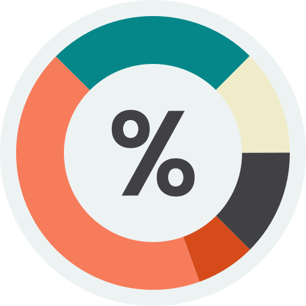

  
  <h1>Quota Checker</h1>
  

    Monitor your Antigravity quotas directly from VS Code. This extension provides a real-time status bar indicator and a detailed dashboard for tracking model usage, reset times, and multiple accounts.
  

## Features

- **Real-time Status Bar:** View remaining quota percentages for your favorite models (Claude, Gemini, GPT, etc.) right in your status bar.
- **Visual Warnings:**
  - 🟡 **Warning:** Background turns yellow when any selected model drops to 20% or less.
  - 🔴 **Error:** Background turns red when any selected model is exhausted (0%).
- **Interactive Dashboard:** Click the status bar item or run `Quota Checker: Open Quota Dashboard` to see a full breakdown:
  - Progress bars for all models.
  - Exact reset times (e.g., "in 4h 30m" or "3 days").
  - Multi-account support (Local + other stored accounts).
- **Multi-Account Support:** Automatically detects the local Antigravity process and reads from `~/.quota-checker/quota.json` to display quotas for other machine IDs.
- **Customizable:**
  - Select which models to show in the status bar.
  - Toggle between **Normal** (5m) and **Intensive** (60s) polling modes.

## Usage

1.  **Install** the extension.
2.  Ensure **Antigravity** is running locally.
3.  The status bar will appear automatically, showing "Connecting..." then your quotas.
4.  **Click** the status bar item to open the dashboard.
5.  In the dashboard:
    - Use the checkboxes to choose which models appear in the status bar.
    - Toggle "Intensive" mode if you need faster updates.

## Configuration

You can configure the extension via VS Code settings:

- `quota-checker.statusBarModels`: Array of model keywords to display in the status bar (default: `["claude", "gemini"]`).
- `quota-checker.pollingInterval`: Base polling interval in milliseconds (default: `30000`).

## Requirements

- Local **Antigravity** instance running on port `8080` (or the configured port).

## Privacy & Security

**Important:** This extension does **not** store or access your Google credentials, API keys, or authentication tokens.

- It reads public quota information exposed by your local Antigravity instance.
- **How it works:** The extension connects to your local Antigravity server (e.g., `http://localhost:8080`) and queries the **Connect RPC endpoint** (`/exa.language_server_pb.LanguageServerService/GetUserStatus`).
- This endpoint provides the same quota data displayed in your IDE's Antigravity chat, without requiring any authentication tokens from the extension itself.
- Data stored locally in `~/.quota-checker/quota.json` is limited to non-sensitive quota metrics (usage percentages, reset times) to support multi-account views.

## Troubleshooting

- **"Error" in Status Bar:** Ensure Antigravity is running. The extension will auto-retry connection on startup.
- **Quotas not updating:** Click the status bar to force a refresh, or toggle "Intensive" mode.

## Release Notes

### 1.0.1

- Added extension icon.
- Improved documentation (README).

### 1.0.0

- Initial release with Status Bar, Webview Dashboard, and Multi-Account support.

## Acknowledgements

- The logic for connecting to the local Antigravity server is based on [antigravity-usage](https://github.com/skainguyen1412/antigravity-usage).
